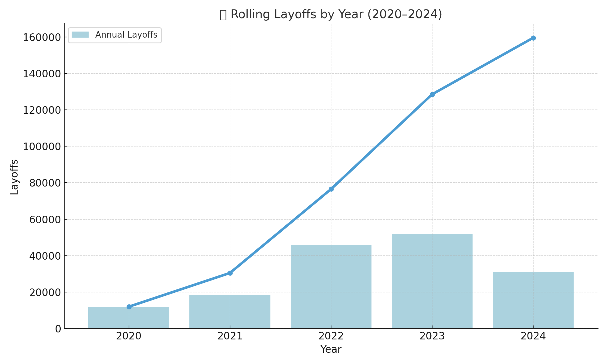
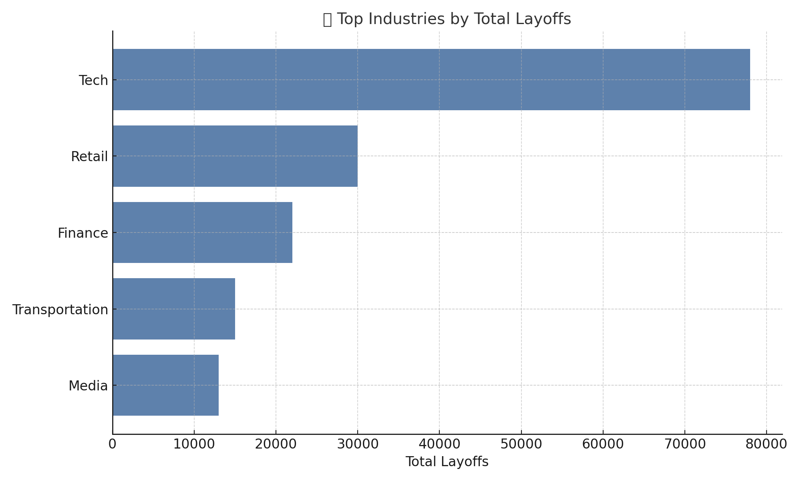

# MySQL Layoff Data Analysis Project

This project dives into global layoff trends from 2020 to 2024 using **MySQL** for both **data cleaning** and **exploratory data analysis (EDA)**. It reveals patterns across industries, countries, time, and more.

---

## 📊 Dataset Overview
Contains:
- Company, Location, Industry
- Total & Percentage Laid Off
- Date, Stage, Country
- Funds Raised

>  Source: Public layoff reports (Kaggle / Layoffs.fyi)

---

## Data Cleaning Process
Using a staging table approach, I:
- Removed duplicates using `ROW_NUMBER()`
- Standardized company & industry names (`TRIM`, `LIKE`, `UPDATE`)
- Replaced null values using self-joins
- Converted `DATE` fields to proper formats
- Dropped helper columns like `row_num`

---

## Key Insights (from SQL EDA)
-  **Tech** faced the most layoffs globally.
- 🇺🇸 **United States** had the highest number of layoffs.
- Layoffs peaked in **Q1 of each year** — strong seasonal trend.
- Top 5 companies per year had **huge layoff spikes**.

---

## SQL Skills Used
- `GROUP BY`, `JOIN`, `CTE`, `CASE`, `RANK()`
- `DATE_FORMAT()`, `STR_TO_DATE()`
- Window functions: `ROW_NUMBER()`, `DENSE_RANK()`, `LAG()`, `SUM() OVER()`
- Data cleaning with `TRIM`, `NULL` handling

---

## Sample Output

### Layoffs by Year (Rolling Total)

### Top Industries by Layoffs

---

## Files Included
- `Final Project.sql` — All SQL code (cleaning + EDA)
- `/screenshots` — Output visuals for recruiters

---

## Connect With Me
**Muhammad Farrukh Ali**  
📧 farrukhaliok@gmail.com  
🔗 [LinkedIn](https://www.linkedin.com/in/farrukh-ali01/)
